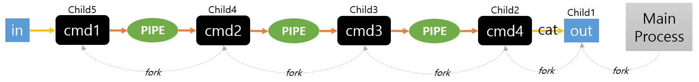

## Pipex

1. 사용 가능 함수 및 알아둘 것
	- `>` : 표준출력 리다이렉션. 명령어 뒤에 나오는 파일에 쓸 때 사용(write / overwrite), 파일 없으면 생성하고, 있으면 덮어씀
	- `>>` : 명령어 뒤에 나오는 파일에 추가할 때 사용(append)), 파일 없으면 생성하고, 있으면 이어서 씀
	- `<` : 표준입력 리다이렉션. 명령어 뒤에 나오는 파일을 표준입력으로 사용
	- `<<` : here document. `<< EOF` 이런 식으로 쓰면 EOF를 입력할 때까지의 내용을 임시 파일로 만들어 표준입력으로 넣음
	- `int access(const char *pathname, int mode)` : `unistd.h`에 존재, 파일이 존재하는지, 읽거나 쓰거나 실행이 가능한 지를 확인하는 함수. 만약 파일이 심볼릭 링크라면 링크의 원본을 체크, mode는 `R_OK`, `W_OK`, `X_OK`, `F_OK`, 리턴 값은 0, -1(모드 에러 또는 파일 없음)
	- `int unlink( const char *path)` : `unistd.h`에 존재, 링크 삭제 함수, 리턴 값은 0, -1(실패)
	- `pid_t waitpid(pid_t pid, int *status, int options)` : `wait.h`에 존재, 자식 프로세스 작업이 끝날 때 까지 대기하며, 자식 프로세스가 종료한 상태를 구함, 리턴 값은 자식 프로세스의 종료 상태, 특정 자식 프로세스가 끝나야만 대기가 풀림
	- `pid_t wait(int *status)` : `wait.h`에 존재, 자식 프로세스 작업이 끝날 때 까지 대기하며, 자식 프로세스가 종료한 상태를 구함, 리턴 값은 자식 프로세스의 종료 상태, 자식 프로세스가 여러 개면 그 중 어떤 것이라도 끝나면 대기가 풀림
	- `int pipe(int filedes[2])` : `unistd.h`에 존재, IPC에서 사용하는 파이프를 생성하며, fd[0]은 입력, fd[1]은 쓰기 전용
	- `int dup(int fildes)` : `unistd.h`에 존재, 파일 디스크립터를 복사함, 커널에서 사용하지 않는 디스크립터 번호 중에 하나가 자동으로 지정됨
	- `int dup2(int fildes, int want_fd)` : `unistd.h`에 존재, 파일 디스크립터를 복사함, 사용자가 원하는 디스크립터 번호로 지정 가능, 리턴값은 원하는 파일 디스크립터 번호, 실패하면 -1 반환
	- `int execve (const char *filename, char *const argv [], char *const envp[])` : `unistd.h`에 존재, 다른 프로그램 실행 함수, 전체 경로명, 파라미터 배열, 환경변수 배열
	- `fork()` : `unistd.h`에 존재, 부모 프로세스를 복사해 자식 프로세스를 만드는 함수, 리턴값은 부모 프로세스에는 생성된 자식 프로세스의 PID, 자식 프로세스에는 0, 실패시 -1
	- `perror()` : 에러메시지 출력
	- `strerror()` : 에러메시지 출력, perror보다 좀 더 자유로움
	- `open()`
	- `close()`
	- `read()`
	- `write()`
	- `malloc()`
	- `free()`
	- `exit()`

 

2. Objectives
	`./pipex file1 cmd1 cmd2 file2`
	- Pipex 프로그램 만들기
	- file1, file2는 파일 이름이고, cmd1과 cmd2는 shell명령어와 파라메터임
	- `< file1 cmd1 | cmd2 > file2` 같이 동작함
	- `./pipex infile "ls -l" "wc -l" outfile` == `< infile ls -l | wc -l > outfile`

 

3. Bonus part
	- 여러 명령어 실행
	- 첫번째 파라메터가 here_doc일 때 <<와 >> 지원

 

+ [참고1](https://ko.eyewated.com/exec-linux-%EB%AA%85%EB%A0%B9-unix-%EB%AA%85%EB%A0%B9/)
+ [참고2](https://shinb.tistory.com/405)

 

---

 

4. 구현
	 
	- 재귀로 구현
	- 첫번째 명령어가 나올 때까지 fork해서 각 명령어를 실행할 프로세스 생성
	- 명령어 실행 전, 생성한 파이프를 통해 명령어 실행 결과를 부모, 자식 간에 알 수 있도록 dup2로 표준입출력을 바꿔줌
	- 첫번째 명령어의 경우 표준입력(0)을 파일로 변경하고, 표준출력(1)을 부모와의 파이프의 쓰기(1)로 바꿈
	- 다른 명령어의 경우 표준입력(0)을 자식과의 파이프의 읽기(0)로 바꾸고, 표준출력(1)을 부모와의 파이프의 쓰기(1)로 바꿈
	- 명령어를 다 실행한 결과는 마지막에 표준입력(1)을 자식과의 파이프의 읽기(0)로 바꾸고, 표준출력(1)을 만들고자하는 파일(ex. outfile)로 연결
	- outfile을 만들 때는 `cat` 명령어를 사용해 입력하는 방식을 이용