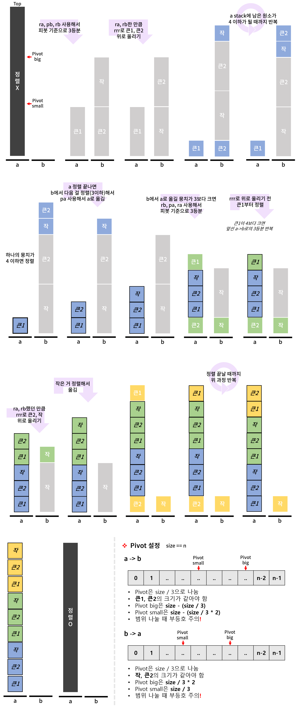

## Push Swap

1. Game rules
	- a와 b라는 2개의 스택이 존재
	- a에는 중복이 없는 임의의 양수, 음수 값이 들어가 있음
	- b는 비어 있음
	- **스택 a를 오름차순으로 정렬하는 게 목표**

 

2. 사용할 수 있는 operations
	- 스택 내에서 스왑
		- sa : a 스택 내의 가장 위의 2개의 원소를 스왑
		- sb : b 스택 내의 가장 위의 2개의 원소를 스왑
		- ss : sa, sb 동시에 실행
	- 스택끼리 스왑
		- pa : b 스택의 가장 위의 원소를 a 스택에 넣기
		- pb : a 스택의 가장 위의 원소를 b 스택에 넣기
	- 스택 내에서 로테이션
		- ra : a 스택 내의 모든 원소를 하나씩 위쪽으로 쉬프트(첫번째 원소가 마지막 원소가 됨)
		- rb : b 스택 내의 모든 원소를 하나씩 위쪽으로 쉬프트(첫번째 원소가 마지막 원소가 됨)
		- rr : ra, rb를 동시에 실행
		- rra : a 스택 내의 모든 원소를 하나씩 아래쪽으로 쉬프트(마지막 원소가 첫번째 원소가 됨)
		- rrb : b 스택 내의 모든 원소를 하나씩 아래쪽으로 쉬프트(마지막 원소가 첫번째 원소가 됨)
		- rrr : rra, rrb를 동시에 실행

 

3.
 
